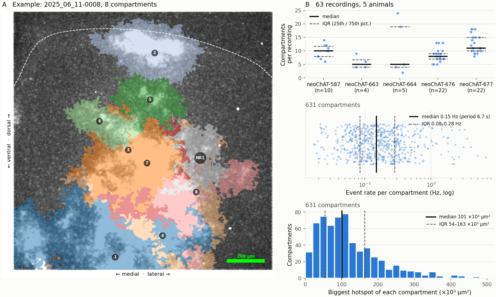

# Paper discussion notes — PB_001

Story logic of the paper, built step by step (2026-10-05), plus the background discussion it grew from (2026-10-02 / 03).
Discussion only: **no `results/` were changed.** 2026-10-06: revised zone grouping tested in scratch; 2026-10-07: moved into the pipeline (step 2, "Zone grouping"), formal re-run pending.

Sources used:
- Numbers: `D:\Programs\PG_005\results` (2.0σ, `MIN_OBJECT_UM2 = 900`, deigo 45504859; spontaneous saion 4734460), `RESULTS_GUIDE.md`.
- Paper drafts: `D:\Work\Vault_0\A4_Publications` (copy in `output/A4_Publications/`).
- Literature: `D:\Work\Vault_0\A5_Converted_Notes` (Brimblecombe & Cragg 2017, Matityahu 2023 + SI, Hamid 2021).

**Contents**
- Part A — Story logic (current): overview, steps 1–5, open TODOs, Discussion items
- Part B — Background notes (2026-10-02 / 03): Kang's self-talk, checked discussion, literature, numbers

---

# Part A — Story logic (current, 2026-10-05)

Rule: logic first, then pick the results that serve it. Each step is fixed before moving on.

## Overview

| Step | Question | Answer | Status |
|---|---|---|---|
| 1. Problem | If we image ACh itself, do we see compartments? | (sets the definition) | ✅ final |
| 2. Spontaneous zones | Are there areas of recurring ACh release? | Yes: zones = candidate ACh compartments | 🟡 in progress |
| 3. One ChI | Is a single ChI sufficient to supply a compartment? | One ChI **can** supply a compartment-sized area | 🟡 in progress |
| 4. Wave-like spread | Can one ChI spread ACh like a wave? | No, if the hotspot fades in place | 🟡 in progress |
| 5. Answer to step 1 | So, does ACh reveal divisions, and of what kind? | A new kind of division with a cellular basis | 📝 draft |

---

## Step 1: Problem (final, 2026-10-05)

**Final wording:**

> The striatum lacks anatomical divisions that match its functions. A precedent shows that chemistry can reveal such divisions: AChE staining first exposed striosome and matrix, which were later found to serve distinct functions. ACh itself modulates striatal circuits, tuning SPN excitability and gating synaptic plasticity, so areas with different ACh levels would be modulated differently. Yet AChE is a static marker, and whether the ACh level itself differs across the striatum is unknown. We therefore imaged ACh directly and defined an **ACh compartment** as an area whose ACh level is distinct from its surroundings in both space and time. Such compartments need not match striosome or matrix; like them, they may carry their own functions.

➡️ *If we image ACh itself, do we see such areas?*

> [!note] Pending update from step 2
> Definition to become: an ACh compartment is an area that **repeatedly** reaches an ACh level distinct from its surroundings. Sync to all docs once step 2 is final.

**Decisions:**
- **Definition:** distinct in **both** space **and** time (not "or").
- **"ACh level"**, not "signal": the sensors (GACh3.0, iAChSnFR) are intensity-based and track concentration. "Level" reads as concentration without claiming absolute µM; the uncalibrated part goes in Methods only.
- **Striosome / matrix = precedent only** (chemistry → hidden functional units). Our compartments are **not** claimed to be striosome / matrix; their circuit details (limbic input, projection to DA neurons) are left out.
- **No "ACh drives DA release":** the direction is debated (Matityahu 2023: reciprocal CIN ↔ DA-axon coupling, DA can inhibit CINs). Keep only SPN excitability and plasticity (citations needed).
- **Novelty = static marker vs dynamic signal:** AChE = enzyme snapshot in fixed tissue; imaging = the transmitter itself, live, over time.
- **Literature gap:** Brimblecombe & Cragg 2017, "unclear whether ACh itself" differs between striosome and matrix.

---

## Step 2: Spontaneous zones (in progress)

**Draft logic:**
1. We image spontaneous ACh in striatal slices.
2. Some areas briefly rise above their surroundings: **hotspots**, each an event of ACh release by ChIs.
3. Hotspots recur at the same places; we group them into **compartments** (places of recurring hotspots).
4. A compartment is a place that repeatedly receives ACh from ChIs → matches the compartment definition → **candidate ACh compartments**.

**Terms (2026-10-07):** **zone** = any mapped region; **compartment** = recurring zone (trace-corr based, the only ones in stats); **NR zone** = non-recurring zone (overlapping leftovers, reference only).

**Agreed:**
- **Hotspot = event, compartment = place.** A hotspot is already distinct in space and time (that is why it is detected); recurrence is what makes a place.
  - Hotspot: an area whose ACh level rises above its surroundings for a brief period.
  - ACh compartment: an area where hotspots recur, i.e. a place that repeatedly reaches an ACh level distinct from its surroundings.
- **"Recurring", not "frequent":** no rate threshold to defend; the exact criterion goes in Methods.
- **Claim chain split:**
  - hotspot = ACh release → step 2 (safe);
  - release from ChIs → step 2 (safe in slices: ChIs are the principal striatal ACh source, outside cholinergic inputs are cut);
  - ChIs **modulate** the area → step 5 / Discussion only, as a possibility (release ≠ modulation).

**Results to show (Kang, tentative):**
1. Example map of all zones in one recording — the recording with the highest coverage.
2. Recurring frequency of zones.
- Still considering: median zone area (may fit step 3 better, where size is compared).
- Both need the formal re-run with the revised grouping below (in the pipeline since 2026-10-07).

### Results text (draft 2026-10-07, numbers filled from the latest Saion run)

Updates the old parts of Paper draft Results §1 (`PB_001_Paper draft.md`); the section title is not changed yet.

> We first imaged ACh without reference to the patched neuron. In GRAB-ACh3.0 recordings at 10× (1,200 frames at 20 Hz), we detected hotspots, areas whose ACh level briefly rose above their surroundings, frame by frame. Hotspots that recurred at the same place were grouped into compartments: hotspots in consecutive frames were linked, and hotspots with highly correlated time courses were grouped (see Methods). Compartments were found in 63 of 103 recordings (8 of 15 slices, 5 of 8 animals), 631 compartments in total (9 [7–12] per recording, median [IQR]). The remaining 40 recordings, all from three animals, showed almost no hotspots at all (median 0 per recording); these three animals received a 10-fold diluted sensor virus, which points to too little sensor expression rather than to an absence of ACh release. Each compartment received a hotspot every 6.7 s (median [IQR 3.5–11.9 s]; 0.15 [0.08–0.28] Hz) [chance level: pending]. Single hotspots could be large: the largest hotspot of each compartment measured 101 × 10³ µm² (median [IQR 54–163 × 10³ µm²]), and in half of the compartments it exceeded 100 × 10³ µm² (Fig. 1). These compartments are places that repeatedly reach an ACh level distinct from their surroundings in space and time, that is, candidate ACh compartments. Because a single hotspot can be this large, we next asked whether one ChI can release enough ACh to produce a hotspot of this size.

*Figure 1. [TO ADD] (A) Maximum projection with all compartments colour-coded and numbered; dashed line = striatum boundary (example: 2025_06_11-0008, 8 compartments). (B) Compartment count, event rate and per-event coverage across recordings.*

*Draft 2026-10-07, made by scratch `output/test06/fig1_draft.py`. A = page 1 of the Saion `ZONE_MAPS.tif`, cropped (QC title and z colorbar cut off).*
*B (top): number of compartments in each recording, grouped by animal (neoChAT-587, -663, -664, -676, -677; n = recordings per animal; only the 63 GACh3.0 recordings with ≥ 1 compartment). Each dot = one recording (jittered sideways); solid black line = median of that animal's recordings; dashed gray lines = IQR (25th / 75th percentile).*
*B (middle): event rate of each compartment (631 compartments, pooled over recordings), log axis; solid line = median, dashed lines = IQR.*
*B (bottom): for each compartment (n = 631), the size of its biggest hotspot during the recording (one value per compartment), ×10³ µm². Solid line = median, dashed lines = IQR. Same unit as the single-ChI hotspot in step 3. Example: the first bar = 32 compartments whose biggest hotspot was 0–20 × 10³ µm².*

**Numbers and sources (2026-10-07, GACh3.0 only, `results/spontaneous/` from the latest Saion run):**

| Number | Value | Source |
|---|---|---|
| Recordings / slices / animals with ≥ 1 compartment | 63 / 103, 8 / 15, 5 / 8 | `spontaneous_summary.xlsx` `recordings` + `rec_data.db` SLICE + `exp_info.db` BASIC_INFO (DOR → animal); scratch `output/test06/step2_stats.py` |
| **Paper rule (2026-10-07)** | a compartment needs ≥ 2 separate events (recurring in time). Drops 1 pipeline compartment: `2025_06_11-0006` #11 = two hotspots ~470 µm apart firing **together** once (frames 1000–1008), grouped by trace correlation (synchrony, not recurrence). Applied in the scratch scripts only, not in the pipeline | `output/test06/one_event_compartment.py`, `one_event_frames.py` |
| Compartments, per recording | 631; 9 [7–12] (mean 10.0 ± 4.2), recordings with compartments | same |
| No-compartment animals | 660, 661, 662 (2025_11_27, 12_14, 12_18): 40 recordings, median 0 hotspots detected; all injected 2025_11_09 with 0.1X AAV1-121922-GREEN (3 of the 4 animals that got 0.1X; 587 also 0.1X but 98 compartments). Confounded with surgery day and sex (all M) | `exp_info.db` INJECTION_HISTORY; `output/test06/animal_settings.py`, `detected_per_day.py` |
| Event rate (pooled compartments, option b) | 0.15 [0.08–0.28] Hz; period 6.7 [3.5–11.9] s; mean 0.29 ± 0.54 Hz (skewed → median); max 6.67 Hz to check in step 3 (may be a patched-neuron compartment) | `compartments` sheet; `step2_stats.py` |
| **Largest hotspot per compartment (used in text / Fig. 1B)** | median 101 × 10³ µm² [IQR 54–163 × 10³], range 8.6–509 × 10³; ≥ 50 × 10³: 78 %, ≥ 100 × 10³: 51 %, ≥ 200 × 10³: 16 % of 631 compartments. Per active frame, the compartment's hotspot = the blob of the binary `_HOTSPOT_MASK.tif` with the largest overlap with its footprint, size = the whole blob; max over frames. Check: 0008 compartment 2 → 61,225 px = 108,844 µm² (frame 1104) | `output/test06/largest_hotspot.py` → `output/test06/largest_hotspot.xlsx` |
| ~~Per-event coverage~~ (dropped from the text 2026-10-07: % of the compartment is not needed for the step-3 comparison, which is in µm²) | event = run of consecutive active frames (6,393 = `n_events`); all events 0.18 [0.06–0.43]; compartments with ≥ 1 event ≥ 80 %: 238 / 632 (leave-one-out 221 / 631) | `output/test06/event_coverage.py` → `output/test06/event_coverage.xlsx` |

**Changed vs the old paragraph:**
- All numbers refreshed (old ones were from saion job 4734460, old grouping); iAChSnFR (2 recordings) left out.
- Compartment counts reported per recording (median [IQR]), not summed per slice / animal: recordings of one slice may image the same field again, so sums double-count.
- "Often fills" → "single hotspots could be large" with the largest hotspot per compartment in µm² (same unit as the step-3 single-ChI hotspot).
- "zones" → **compartments** (NR zones not in stats).
- Removed "discrete" (compartments overlap) and "the striatum is divided into" (a step-5 claim).
- Striatum coverage removed from the claim (descriptive only, 2026-10-07); can return as a plain number if wanted.
- Added observation 2 (large single hotspots, µm²) and the bridge to step 3.
- Fig. 1: "zones" → compartments, old example numbers (26 zones, coverage 0.64) → placeholders; coverage → per-event coverage in (B).

### Zone grouping (revised 2026-10-06, in the pipeline 2026-10-07)

Tested in scratch (`output/test01/all_zones_circle.py`), then ported to `classes/sp_zone_analyzer.py` (identical to the scratch on `2025_06_11-0003` / `2025_12_15-0012`). Formal re-run of `results/spontaneous/` pending.

**Why revise:**
- Hotspots in one trace-corr group are at the same place: distance between two hotspots in a group, median 15.5–27.7 px (≈ 21–37 µm) per recording, 7 recordings. So the hand-set 115 px (≈ 153 µm) was too loose (TODO 4, 5).
- Linking consecutive frames by centroid < 115 px could join hotspots that don't touch.
- A unit's trace was the **average** of its hotspots' traces; averaging could hide a real match (one hotspot r = 0.986, the averaged unit r = 0.885).
- The 1 % size filter (10,486 px) dropped blobs that mask cleanup kept (4,000–10,486 px), about 1 in 3 hotspots in 0003, e.g. the top hotspots of frames 10–13.

**Rules:**

| # | Grouping | Rule |
|---|---|---|
| 0 | Detect | threshold = background peak + 2σ; mask cleanup drops blobs < 4,000 px; **no 1 % lower size limit** (80 % upper kept) |
| 1 | Consecutive frames → units | hotspot in frame n+1 joins hotspot in frame n if its centroid lies inside n's circle (centroid → farthest pixel) |
| 2 | Trace correlation | r between two units = **best r** among all pairs of their hotspots' own traces (no averaging); every two units in a group r ≥ 0.95 |
| 3 | Merge compartments | a compartment ≥ 95 % inside another is merged into it (`TH_MERGE_ZONES = 0.95`) |
| 4 | Fit leftovers | a leftover unit joins its best compartment if its **best hotspot** lies ≥ 90 % inside it (`TH_FIT_ZONES = 0.90`) |
| 5 | Leftovers that overlap → **NR zones** | split into type 1 (0 px with every compartment) and type 2 (the rest); within each type, units sharing ≥ 1 px form an NR zone (≥ 2 units); single units are **dropped** |

- Proximity grouping (115 px) is removed.
- **Rule B (2026-10-07):** only groupings 2–4 make **compartments**. Grouping-5 zones are **NR zones** (same place, different time course = weak recurrence): kept in the xlsx (`non_recur_zones` sheet) and drawn light gray (NR1, NR2, ...) on the zone maps, NR hotspots hatched `////` on frame pages, but **left out of every stat** (count, size, frequency, coverage). A recording without trace-corr groups has **no compartments**.

**Numbers (pipeline, 4 test recordings, 2026-10-07):**

| | 0009 | 0003 | 0011 | 0012 |
|---|---|---|---|---|
| Hotspots → units | 0 (frame-1 giant dropped) | 554 → 151 | 37 → 26 | 103 → 55 |
| 2. Trace-corr groups (hotspots) | 0 | 15 (518) | 0 | 9 (93) |
| 3. Merges | 0 | 6 | 0 | 0 |
| 4. Units fitted | 0 | 9 | 0 | 1 |
| **Compartments** | **0** | **9** (old pipeline: 26 zones) | **0** | **9** |
| NR zones (type 1 / 2) | 0 | 2 (0 / 2) | 1 (1 / 0) | 2 (1 / 1) |
| Dropped units / hotspots | 0 | 2 / 2 | 0 | 2 / 3 |
| Striatum coverage | 0 | 0.627 | 0 | 0.528 |

- 0011 had 1202 frames in the raw TIFF (also 0005, 0007–0010 of 2025_11_27); Kang fixed the raw files, all 6 re-processed (2026-10-07).

> [!note] Grouping-5 chaining (TODO 9) — resolved by Rule B
> Grouping 5 chains by ≥ 1 px (A touches B, B touches C → one NR zone). Before Rule B this made 0011 one zone of all 26 units (51 % of the frame with the 1202-frame file). Now it only changes how NR zones look; no stat uses them.

**Outputs (names, 2026-10-07):** `{stem}_ZONES.xlsx` sheets `counts`, `compartment_stats`, `compartments` (`compartment_id`, `active_frames`), `non_recur_zones`, `step3_merge`, `step4_fit`, `step5_overlap`; `{stem}_ZONE_MAPS.tif`; `footprints/{stem}_ZONES.npz`; `mask/{stem}_HOTSPOT_MASK.tif`; `spontaneous_summary.xlsx` (`n_compartments`, `n_non_recur_zone_type_1/2`, `n_dropped_units/hotspots`, `compartment_area_in_striatum_um2`, ...).

**TODOs:** 4, 5, 8, 9 done — see [Open TODOs](#open-todos). Formal re-run pending.

---

## Step 3: Can one ChI supply a compartment? (in progress)

**Bridge (agreed):**

> Each compartment is a unit of cholinergic influence. Because these compartments may relate to neural functions, it matters what drives them: whether a single ChI is sufficient, or coordinated activity of several ChIs is required. A single ChI's axon arbor innervates a large area (Aosaki 1995), so one cell could, in principle, supply a whole compartment.

**Draft logic (revised 2026-10-07):**
1. We patch one ChI and record its spikes while imaging ACh. Spikes are evoked or spontaneous, and we record its firing rate for each.
2. We align the imaging to its spikes and take the median over spikes (MED) → the hotspot that typically follows one successful spike.
3. **Attribution:** a spike counts as successful only if its hotspot appears at the MED location (reliability). This happens more often than a hotspot appears there by chance on non-aligned frames (intrusion rate) → the hotspot is locked to this cell's spikes.
4. **Size:** we compare the MED area with the largest hotspot of each *other* compartment in the same slice, for evoked and spontaneous spikes separately. Conservative: a typical single-spike hotspot vs each compartment's biggest event.
5. If the size is comparable, one ChI **can** supply a compartment-sized area.

*Moved to Discussion (2026-10-07):* rate — event rate of the compartment the MED sits on vs the cell's firing rate × reliability (uses the MED's own compartment, unlike the size test).

**Results text (skeleton, numbers pending):**

> **One ChI can supply a compartment-sized area.**
> We patched [n] ChIs in [n] slices and imaged ACh while they fired spontaneously ([f] Hz) or were evoked ([f] Hz).
> The hotspot that followed a spike appeared at the same place in [R] % of spikes, above the [chance] % expected from non-aligned frames, so it is locked to the patched cell.
> The single-spike hotspot covered [area] µm², compared with [area] µm² for the largest hotspot of the other compartments in the same slice (evoked: […]; spontaneous: […]).
> [Evoked / spontaneous share of the recordings (TODO 24) — where to state it is decided with reliability / intrusion rate.]

**Decided 2026-10-07:**
- **Size comparison = other compartments of the same recording** (option b), not the compartment the MED sits on, not all recordings pooled. Replaces the old Group C (unmatched compartments, median per-frame area).
- **Measure = largest hotspot per compartment (µm²)**, as in step 2 Fig. 1B; typical vs extreme is stated as conservative.
- **Two-pass MED:** MED of all segments → MED location → back-check → MED of hits only = final MED. The current code builds the MED from segments with a hotspot *anywhere* (`ach_domain_analysis.py`, Step 3), so the area changes after the fix → rerun before comparing.
- Plan: `.claude/plans/2026-10-07_step3_plan.md` (phases: f_ChI → back-check → non-aligned → rerun → `area_comparison.py` → figure + text).

**Agreed:**
- **"Influence", not "modulation"** (release ≠ modulation). Matches the title "a broad domain of local influence".
- **"Sufficient" vs "required"**, not "single ChI or network" (both may operate).
- **Wording: "can"** = sufficiency, not ownership.
- **Evoked / spontaneous and event vs place (temporarily OK):** existing `area_comparison.py` plan — evoked (A) and spontaneous (B) spike hotspots as separate groups, each compared with compartments (C); event vs event (C = each zone's median per-event hotspot size). Union-area option still open (TODO 2).
- **Attribution = inside step 3**, three pieces:
  - a. Current reliability: hotspot *anywhere* in the frame at spike / spike+1 → background only (not tied to location).
  - b. Kang's MED back-check: a segment counts as a hit only if its hotspot falls where the MED hotspot is → "real" reliability.
  - c. Jeff's intrusion rate: non-aligned frames, how often a hotspot appears at the same place by chance → chance level, evoked and spontaneous separately.
  - **b > c** → the hotspot is locked to this cell's spikes.

**TODOs:** 1b, 1c (attribution), 2 (zone size measure), 6 (Aosaki) — see [Open TODOs](#open-todos).

---

## Step 4: Can one ChI spread ACh like a wave? (in progress)

**Draft logic:**
1. Compartments are units of influence. We want to know whether they communicate; one candidate route is wave-like ACh transmission.
2. First, the single-cell end: can one ChI spread ACh like a wave?
3. We follow how the single-spike (MED) hotspot moves over time (flow analysis).
4. If it fades in place, one ChI is **not** sufficient for wave-like spread. Waves between compartments, if they exist, would need coordinated firing of many ChIs (consistent with Matityahu 2023's coupling model).

**Agreed:**
- **Why the MED cannot show relations between compartments:** it keeps only release locked to the patched cell's spike (the median removes everything else), covers one cell and a ±10-frame window. It can show whether **one** ChI's release spreads like a wave.
- **Mirrors step 3:** one ChI sufficient for a compartment-sized area (yes, can) / one ChI sufficient for wave-like spread (no, if it fades in place).
- **Waves between compartments in the spontaneous movies → Discussion / future work.** Needs a wave definition first (Kang's reading of Matityahu 2023, Hamid 2021).
- **Limits:** 20 Hz cannot resolve spread within the first 50 ms; the claim holds only within the field of view and the ±10-frame window.
- **Wording:** "Within the field and time window observed, the single-spike hotspot showed no wave-like spread."
- **Slices:** we *can* look for waves in slices, but not finding them is weak evidence (slices lose inputs and possibly the coupling that drives waves in vivo). Replaces the earlier "slices cannot test for waves".

---

## Step 5: Answer to step 1 (draft)

**Role:** close the loop with the step-1 problem, not a summary of findings (the summary = Discussion paragraph 1, already in the docx). Rejected: a conclusion that restates steps 2–4; no step 5 at all.

**Step 1 asked:** the striatum lacks divisions that match its functions. If we image ACh itself, do we see such areas?

**Step 5 answers:**
1. **Yes, and they are a new kind of division:** defined by recurring ACh release, not by a stain or a cell marker.
2. **They have a cellular basis:** a single ChI can be enough to drive one, so a division can be traced to an identifiable cell (unlike a stain pattern).
3. **They open new questions** (Discussion takes over):
   - Do these divisions carry functions, like striosome and matrix?
   - How do they relate to each other, e.g. waves?

**Open:** lasting time / "refreshed in pulses" no longer fits any step — drop, step 5, or Discussion?

---

## Open TODOs

Numbers match `docs/continue_from_here.md`.

| # | TODO | Step |
|---|---|---|
| 1b | MED back-check reliability: hit only if the segment's hotspot falls where the MED hotspot is | 3 |
| 1c | Intrusion rate on non-aligned frames, evoked / spontaneous separately; compare with 1b | 3 |
| 2 | ~~Compartment size measure for the comparison~~ → per-event vs per-event (2026-10-07): one ChI spike = one event, so compare with single compartment hotspots, not the union area | 3 |
| 3 | "Stays local" number (e.g. centre shift ÷ hotspot radius) + per-recording lasting time (t_end) | 4 |
| 4 | ~~Proximity distance is hand-set (115 px)~~ → resolved in the revised grouping (2026-10-06, scratch): circle rule for consecutive frames, proximity grouping removed | 2 |
| 5 | ~~Trace-corr zones = same place?~~ → yes (2026-10-06): median distance between two hotspots in a group 15.5–27.7 px (≈ 21–37 µm), 7 recordings | 2 |
| 8 | ~~Move the revised zone grouping into `classes/sp_zone_analyzer.py`~~ → done 2026-10-07 (+ Rule B, NR zones, zone → compartment naming); formal re-run of spontaneous results (R1 map, R2 frequency) + `area_comparison.py` pending | 2 |
| 9 | ~~Grouping 5 chaining (≥ 1 px)~~ → resolved by Rule B (2026-10-07): grouping-5 zones are NR zones, out of every stat | 2 |
| 6 | Check Aosaki 1995: exact axon-arbor range and species before citing | 3 |
| — | Kang: read how waves are defined (Matityahu 2023, Hamid 2021) before any wave analysis | 4 / Discussion |
| 11 | ABFClip: spontaneous / evoked spike frequency of the patched ChIs (`f_ChI`); compare compartment event rate with `f_ChI × R` | 2 → 3 |
| 12 | Non-aligned analysis (= 1c) | 3 |
| 13 | MED back-check + recalculate reliability (= 1b); two-pass MED (all segments → location → hits only = final MED) | 3 |
| 24 | Share of recordings that are evoked vs spontaneous (`hotspot_origin`): (a) all patched recordings, every objective + (c) 10X recordings with a MED; for later use with reliability and intrusion rate | 3 |
| 14 | Figure: most / intermediate / least reliable spike patterns (+ frames) | 3 |
| 15 | Step 2 text: **chance level** for "recurring" (chance test vs trace correlation) — `[chance level: pending]` in the draft | 2 |
| 16 | ~~Step 2 Fig. 1: pick the example recording for (A)~~ → `2025_06_11-0008` (2026-10-07; 8 compartments + 1 NR, 0.164 Hz, 3 compartments with a ≥ 80 % event; picked from 6 typical candidates, `output/test06/fig1_candidates.py`). Fig. 1 itself not made yet | 2 |
| 17 | Step 2 Methods: revised grouping (Rule B), event = run of consecutive active frames, largest hotspot per compartment (blob with the largest footprint overlap); Vault Methods to-do 5 is still the old version | 2 |
| 18 | Step 2 section title (not changed yet) | 2 |
| 19 | 6.67 Hz compartment (period 0.15 s): check in step 3 — may be the compartment of a patched neuron | 2 / 3 |
| 20 | Copy the step-2 Results text into the Vault draft (`PB_001_Paper draft.md`) when final | 2 |
| 22 | Final Fig. 1 in `functions/plot_results.py` (with OK); z colorbar back on panel A | 2 |
| 23 | Step 3 `area_comparison.py`: ~~MED vs its own (matched) compartment~~ → logic decided 2026-10-07: MED vs largest hotspot (µm²) of the **other** compartments in the same recording; after TODOs 13 / 12 and the `ach_domain_analysis` rerun. Plan: `.claude/plans/2026-10-07_step3_plan.md` (phase 5) | 3 |
| 21 | ~~Per-event coverage over-counts neighbours' hotspots~~ → dropped (2026-10-07): text / Fig. 1B now use the largest hotspot per compartment in µm² (blob with the largest footprint overlap). Remaining small caveat: a hotspot made of separate fragments counts only its biggest blob, and a neighbour's blob touching it would join it | 2 |

---

## Discussion items collected so far

- **Waves between compartments** in the spontaneous movies (moved from step 4).
- **Evoked vs spontaneous spike hotspots:** spontaneous ones are larger; co-firing of other ChIs may add to them (Part B §3).
- **Modulation** (SPN excitability / plasticity) as a possibility only.
- **Do the divisions carry functions**, like striosome / matrix (step 5).
- **Lasting time / "refreshed in pulses"** — if not placed in a step (Part B §4).

---
---

# Part B — Background notes (2026-10-02 / 03)

> Kept for reference. Where Part A decided differently, Part A wins; superseded points are marked.

## Kang's original self-talk (verbatim, 2026-10-02)

> Kept word for word as written, for hints and ideas to revisit.

1. Why study this, the compartments in the striatum? Lack of clear anatomical sections on the basis of neural functions. Inspired by patches and matrix stained by AChE. It was found that the type of chemically defined area/compartments are actually related to certain behavior functions. ACh is the neurochemical, why not directly check it? We just have the kine of intensity based, genetically encoded tools designed for ACh.

2. So what can current results do? spontaneous ACh Zones. Temporally or Spatially linked hotspots. Found use global intensity historgram (n_bins 256) theshold at 2 sigma if I remember correctly. OK, why linking them? we want to see if there are groups of hotspots repetitively occur in the same place. If so maybe CINs are trying to "maintain" that area's ACh concentration -> could be a compartement (may like matrix, low [AChE] -> low hydrolysis -> high [ACh]). Footprints has highly correlated temporal curves, should be spatially very closed. hotspots with centroids are in proximity, well, really close in space. Left over, some hotspots which are occured in extremely low frequency or maybe like event-related. I want to check the zone sizes at 10X. The 40x and 60x's FOV just too small to see the whole hotspots/zones. It should be large as the range of a cholinergic interneurons' axon spread (Aosaki 1995). OK, the results of this part should let me claim there exists some large area, routinely replenished ACh zones which maybe potentially neurofunction related compartments <- cannot varified now, just propose this idea first. 😜. The first matrix and patches also just staining without any futher check.

3. How these zones are maintained? My guess -> by single Cholinergic interneuron. How am I going to proof? first, a release in normal situation is induced after an action potential (spike) activation (extracytosis). Therefore, I want to use single spikes as event, check if there is any hotspot occurs around the frame. However, right now from reliability analysis, due to the large variation of hotspot poistion and low reliablity, we can not guarantee the detected hotspots are really origin from patched neurons. Jeff suggested something like intrude rate esitmation, analyze and check the spike frequency, non-aligned analysis. Need figure out how to do. I also proposed roll back to original median all segments, then use the detected hotspots to check reliablity (I think this is probably much easier). Anyway, the hotspot sizes are the major things we want to look at to compare the sizes in spontaneous zones. If single neuron's single spike can manage that size of ACh zones, we may imply single neuron may able to manage a local striatal circuit (modulation). By the way, I think discussion is probably like further guessing to what we saw from the actual number of data, like reliablitiy 60% or 100% <- we may ask what happened? or are these number correct? and so on.

4. OK, now we should able to tell and summarize the previous experiemts to derive if a single cholinergic interneuron can create a compartment of not. Next, I also want to check some more properties of hotspots, that's why I fit the decay of area sizes and calculate the flow field. For decay of the area, maybe instead of showing time constants, I should use the fitted function to esitmate average lasting time (the decay time constant is not). Then we maybe compare the period of spontaneous zones to this to see if the matched. Therefore we may judge if really the compartments are really maintained. Lastly, the flow analysis, was originate papers that report the finding of ACh wavelike traveling. However, I still currently don't quite understand how Matityahu and Hamid proof this. Matityahu at least show some video of ACh pass though an ROI. Why I want to do this because I think this wavelike transmission may be the inter compartement communications. However, the current results seems to have pattern like, short source centered expandsion, then almost next frame sink like retraction. Lastly anisotropic fade away.

5. Considering all above and the core of article I think until point 3, we already complete the explanation, however, it will be a little bit not abundant if we have such less analysis. So I'm kind of struggling how the lasting time and flow analysis can be further discussed.

Follow-up replies (same day):
- On AChE: "I think you are right. 'In some sections, in the dorsolateral part of the head of the caudate nucleus, one or more zones appeared that were characterized by a cholinesterase content higher than that of the surrounding tissue.'"
- On the intrusion-rate plan sketch: "That will be great."
- Literature: converted markdowns in `D:\Work\Vault_0\A5_Converted_Notes`.

---

## Earlier story flow (2026-10-03) — superseded by Part A

Kept only for the two decisions that still apply:

- **"Refreshed", not "maintained":** "maintain" = held at a level, which is not what we saw (≈ 0.34 s on / ≈ 9 s off, §4); "refreshed" = re-supplied in short pulses. Where this goes in the story is open (Part A, step 5).
- **"Waves need many CINs" is not our result** → Discussion only, citing Matityahu's model. (The wording "slices cannot test for waves" was replaced in Part A, step 4.)

---

## 1. Why study compartments in the striatum

### Kang's view
- The striatum lacks clear anatomical sections that map onto neural function.
- Inspiration: striosome (patch) / matrix, first revealed by AChE staining. These chemically defined compartments later turned out to relate to behaviour.
- ACh is the neurochemical itself, so why not image it directly? Intensity-based genetically encoded ACh sensors now make that possible.

### Discussion
- The logic is short and strong: *the first compartments were found chemically → ACh is the chemical → image ACh directly.*
- **AChE direction (checked).** In the adult striatum, **striosomes are AChE-poor and the matrix is AChE-rich**:
  - Brimblecombe & Cragg 2017: the matrix "is enriched with … cholinergic markers including acetylcholine esterase (AChE) and choline acetyltransferase (ChAT)"; "AChE is found at higher levels in matrix".
  - Developmental twist (same review): the DA islands that become striosomes are AChE-**rich** in late embryonic / early postnatal life and switch to AChE-poor in adulthood.
  - Kang's quote from Graybiel & Ragsdale 1978 ("In some sections, in the dorsolateral part of the head of the caudate nucleus, one or more zones appeared that were characterized by a cholinesterase content higher than that of the surrounding tissue") describes an additional, less common observation; the main finding is AChE-poor striosomes. (Faull 1989 even proposed a third AChE-defined compartment.)
- **Superseded 2026-10-05:** the story no longer maps ACh zones onto striosome / matrix (Part A, step 1). The two points below stay as background only.
- **Kang's hypothesis, corrected direction:** low AChE → low hydrolysis → higher [ACh] would point to **striosomes**, not matrix. Brimblecombe & Cragg 2017 state exactly this idea and its alternative:
  > "Lower AChE levels in striosomes could be a surrogate marker for low ACh innervation density and low ACh levels, but alternatively, low AChE levels could limit ACh hydrolysis resulting in paradoxically higher ACh levels." They also note: "It is currently unclear whether ACh itself displays variable levels in striosomes versus matrix."
  → This is a direct, citable gap that ACh imaging can address.
- Bonus from the same review: ChIs "tend to occupy the boundary region between striosomes and matrix".

---

## 2. Spontaneous ACh zones

### Kang's view
- Hotspots linked temporally (trace correlation) or spatially (centroid proximity) → zones.
- Why link them: to find groups of hotspots that recur at the same place. If so, CINs may be "maintaining" that area's ACh level → a candidate compartment.
- Correlated footprints should also be spatially close; proximity-linked ones are very close in space. Leftovers are very-low-frequency or event-like hotspots.
- Zone size should be judged at 10X only (40X / 60X fields are too small). It should be comparable to a CIN's axon spread (Aosaki 1995).
- Claim: there are large, routinely replenished ACh zones that may be function-related compartments. This cannot be verified now; propose the idea first (patch / matrix also started as staining only).

### Discussion
- **Threshold detail (checked in code).** Threshold = background peak + **2σ** (`CROSSOVER_RATIO = 2.0`, `classes/sp_zone_analyzer.py:56`). The histogram has **512 bins** (`ZONE_HIST_BINS`), not 256, spanning the 0.1–99.9 percentiles (`ZONE_HIST_RANGE_PCT`, `functions/fit_hist.py:30-31`).
- **10X-only for size is right.** Zone median area 102,700 µm² → equivalent radius √(102,700 / π) ≈ **181 µm** (≈ 360 µm across).
- **Axon-arbor scale.** Matityahu 2023 (Discussion) uses a CIN axonal-arbor radius of "approximately 0.5 mm" (their ref. 102). Zones (r ≈ 180 µm) and 10X spike hotspots (r ≈ 160 µm) are well inside one arbor. One reading: a single spike activates only part of the arbor above threshold, or the 2σ threshold only captures its dense core.
- "Propose first, verify later" is a fair framing, with the patch / matrix history as precedent.

---

## 3. Who maintains the zones? Attribution to a single CIN

### Kang's view
- Guess: zones are maintained by single CINs.
- Release normally follows an action potential (exocytosis), so single spikes are used as events: is there a hotspot around the spike frame?
- Problem: hotspot position varies a lot and reliability is low, so detected hotspots can't be guaranteed to come from the patched neuron.
- Jeff's suggestion: an **intrusion-rate** estimate, i.e. check spike frequency and do a non-aligned analysis.
- Kang's proposal: roll back to the median of all segments, then use the detected hotspot to check reliability (probably easier).
- The main comparison is hotspot size vs spontaneous zone size. If one spike of one neuron can cover a zone, a single neuron may modulate a local striatal circuit.
- The Discussion is partly about questioning the actual numbers (e.g. why reliability is 60 % vs 100 %, and whether the numbers are right).

### Discussion

**How reliability is computed now** (`classes/spike_reliability.py:90-116`):
- Per raw segment: baseline threshold from that segment's own pre-spike frames → categorize spike and spike+1 → density-gated `detect_hotspot`.
- A segment is a "hit" if a hotspot passes the gate **anywhere in the frame**. The hit is **not** tied to the MED hotspot location.
- So current reliability = P(any hotspot in the field at spike / spike+1), which includes spontaneous zone events by chance.

**Quick chance estimate** (back-of-envelope; median spontaneous values: 15 zones, 0.11 Hz each, 20 Hz frames, window = 2 frames):

| Situation | Calculation | Chance hit |
|---|---|---|
| Only the zone at the MED spot | 0.11 Hz × 0.05 s × 2 | ≈ 1.1 % |
| Any zone in the 10X field | 15 × 0.11 Hz × 0.05 s × 2 | ≈ 16.5 % |
| Observed reliability, 10X | — | 66 % |
| Observed reliability, 40X / 60X | — | 13 % / 16 % |

- 10X: 66 % is far above both chance levels → supports a real spike-locked signal.
- 40X / 60X: reliability is in a range where chance could matter (though the smaller field also lowers chance). This is where the intrusion rate is most needed.
- Caveats: zone rates come from 10X spontaneous recordings, not the same recordings or objectives; the per-frame event probability ignores event duration (>1 frame) and the 2σ vs baseline-σ threshold difference.

**Evoked vs spontaneous hint.** Spontaneous-spike hotspots (132,694 µm², n = 18) are larger than evoked ones (74,383 µm², n = 26). One explanation: spontaneous spikes may coincide with other CINs firing, while current-evoked spikes are isolated. If so, evoked hotspots are the cleaner single-cell estimate. Good Discussion item; also relevant to the intrusion analysis.

**Evoked / spontaneous split** of recordings with a detected hotspot (`has_region = 1`, `reliability_pct > 0`, n = 74; `estim_induced` shown as **evoked**):

| OBJ | Evoked | Spontaneous | E : S |
|---|---|---|---|
| 10X | 26 | 18 | 1.44 : 1 |
| 40X | 4 | 4 | 1 : 1 |
| 60X | 15 | 7 | 2.14 : 1 |
| All | 45 | 29 | 1.55 : 1 (61 % evoked) |

Detection rate within each group (all `has_region = 1`): evoked 53 / 114 = 46 %, spontaneous 30 / 52 = 58 %.

**Literature support** (Matityahu 2023):
- "activation of a single CIN suffices to induce local striatal DA release (i.e., synchrony among several CINs is not required)".
- SI Fig. 2b: nine APs in one CIN at 0.2 Hz each triggered ACh release (GRAB-ACh3.0), with ≤ 4 % amplitude decrease from the 1st to the 2nd–9th response (n = 4 CINs).

---

## 4. Lasting time and flow

### Kang's view
- Fit the area decay; maybe report an "average lasting time" estimated from the fitted function instead of τ.
- Compare that with the period of spontaneous zones, to judge whether compartments are really "maintained".
- Flow analysis was inspired by papers reporting ACh wave-like travel (Matityahu; Hamid). Not yet clear how they showed it; Matityahu at least shows videos of ACh passing through an ROI.
- Motivation: wave-like transmission might be **inter-compartment communication**.
- Current result: short source-centred expansion → sink-like retraction almost in the next frame → anisotropic fade.

### Discussion — lasting time
- For a pure exponential A(t) = A₀·e^(−t/τ), the **mean lifetime equals τ** (∫A dt / A₀ = τ). So "average lasting time" from the fit is τ itself.
- A more intuitive number is the **time until the area falls below the detection limit**: t_end = τ · ln(A₀ / A_min).
  - 10X example: τ = 75 ms, A₀ = 80,900 µm², A_min = 900 µm² → 75 × ln(89.9) = 75 × 4.50 ≈ **337 ms** (≈ 7 frames).
  - Should be computed per recording from its own τ and A₀ (fit is from the peak frame to the end of the 21-frame stack; `lasting_time_ms` is NULL when R² < 0.8).
- **Comparison with the zone period:** ≈ 0.34 s on vs ≈ 9 s between events → a zone is ACh-high only ≈ **4 %** of the time. Zones are therefore **refreshed in short pulses**, not continuously maintained: *sparse in time, broad in space.*

### Discussion — how the wave papers measured waves

**Matityahu et al. 2023 (ACh waves, in vivo):**
- GRAB-ACh3.0 through a 3 mm cranial window in head-fixed mice (n = 3); also iAChSnFR via 1 mm window or GRIN lens (n = 6).
- Method: hand-drawn ROI → pixels binned into bands **perpendicular to the ML axis** → mean z-score per band per frame → **space–time plot** (1-D along ML). Diagonal streaks = waves.
- Wave location = band with maximal z each frame; its temporal derivative = instantaneous ML velocity (fluctuates within ±10 mm/s).
- **Bootstrapping:** location vector permuted in chunks of n = 1–20 frames (to respect slow indicator kinetics); compares run lengths between velocity sign reversals against the spurious maximum.
- Wave events: heuristic detector (runs ≥ 5 frames with consistent ML direction, plus intensity conditions); authors note the free parameters "were manually fine-tuned per movie".
- Results: GRAB-ACh3.0 waves every **5.2 ± 0.5 s**, duration **391 ± 9 ms**; iAChSnFR every **8.6 ± 1.2 s**, duration **537 ± 18 ms**; ~80 % lateral → medial.
- Frame rates: in vivo 20 Hz (GRAB-ACh3.0, 4X, 50 ms; iAChSnFR 20 Hz); slices ~31 Hz 2P. Ours: 20 Hz.
- Mechanism (model): reciprocal CIN ↔ DA-axon coupling as a reaction–diffusion system; "Physical diffusion of DA and ACh from release sites is too short-ranged to produce the spread of activation observed in vivo". In some regimes, Turing "hills of activity" give "a dynamical parcellation or tiling [of the striatum] into distinct functional modules of high and low neuromodulatory activity".
- Slice data: electrically evoked DA release falls off over ~500 µm, halved by mecamylamine; CIN recruitment (ChAT-GCaMP6f) falls off over ~200 µm.

**Hamid et al. 2021 (*dopamine* waves, not ACh):**
- dLight and GCaMP6f in DA axons, widefield through a cranial window, in vivo. Widefield 10 Hz (4X, 40 µm/px), dual-colour 20 Hz per channel, 2P 10–15 Hz.
- Method: optical flow (combined global–local, Lucas–Kanade + Horn–Schunck) between successive frames → pixel velocity field (flow speed = mean vector length); **divergence** map → *where* sources / sinks are (visual, not a label / count); MATLAB `stream3` → trajectories from hand-picked source pixels, Fréchet similarity; flow direction distribution (bimodal, ML axis); tdTomato control channel showed no ML bias; seqNMF-like motif detection.

**Relation to our pipeline:**
- Our flow analysis (TV-L1 → source / sink / anisotropic, streamlines) is methodologically parallel to Hamid's (optical flow → divergence → streamlines). Worth stating in Methods / Discussion.
- We also compute TV-L1 on the whole FOV, then use the CAT mask only for the label. Our trace(A) = divergence of the fitted linear field (≈ mean divergence in the hotspot). Our drift term sees a sliding hotspot, which a divergence map cannot (a uniform slide has zero divergence). A divergence map would add *where* (source at the centre / soma? one or several sources?).
- Their waves are population events over mm-scale windows; ours is one spike in a slice. Different questions, same toolbox.
- A Hamid-style null (their tdTomato channel) has a natural analogue here: run flow on random non-spike frames.

### Discussion — reading our flow sequence
- Observed: source (onset, spike−1 → spike+1) → sink (peaks spike+1 → +2) → anisotropic fade; drift 3.5 µm/frame (≈ 70 µm/s), no preferred direction.
- The "sink" phase may be **clearance from the edge inward**: the low-concentration rim drops below threshold first, so the region contracts. This is a clearance signature, not inward ACh movement.
- Compared with in vivo waves (±10 mm/s instantaneous), our drift is ~100× slower → within the field and time window observed (~200 ms after a single spike), no directional spread was seen.

### Striking match (worth checking)
- In vivo ACh waves: every 5.2–8.6 s, lasting 0.39–0.54 s (Matityahu 2023).
- Our 10X spontaneous zones: an event every ≈ 9 s (0.11 Hz); single-spike hotspot lasting ≈ 0.34 s (t_end above).
- The rate and duration are of the same order. Question: are zone events local views of wave-like events through a ~1 mm field, or independent local events? A direct check is the **zone event duration** (from each zone's active frames in `{rec}_ZONES.xlsx`), which we have not summarised yet.

---

## 5. How lasting time and flow can strengthen the story

> Superseded in part by Part A: flow now = step 4 (single-cell wave test); lasting time has no step yet.

### Kang's concern
- Up to point 3 the core argument is complete. With so few analyses the paper feels thin, so how can lasting time and flow be discussed further?

### Suggestions (ideas only)
1. **Size vs time → distributed release, not diffusion.**
   With an assumed tissue diffusion coefficient D* ≈ 0.4 µm²/ms (order of magnitude; needs a reference), ACh spreads √(4 × 0.4 × 75) ≈ **11 µm** in 75 ms (≈ 22 µm in 300 ms). The 10X hotspot radius is ≈ **160 µm** (√(80,900 / π)). One point source cannot explain this; the hotspot must come from **many release sites across the axon arbor at once**. This supports "single-CIN territory ≈ axon field" and matches Matityahu's statement that physical diffusion is too short-ranged.
2. **Pulsed compartments.** ≈ 0.34 s on / ≈ 9 s off gives compartments a temporal identity. It also sharpens the open point that CINs fire tonically at a few Hz while zones appear at 0.11 Hz.
3. **No directional spread from a single spike.** That waves may need many CINs (and CIN ↔ DA-axon coupling) is Matityahu's model, not our result → Discussion only, with citation. This fits Kang's idea that waves are **communication between compartments**, not spread within one.
4. **Link to the compartment literature.** Matityahu's Turing-pattern "hills of activity" are a theoretical version of dynamic compartments; Brimblecombe & Cragg note it is unknown whether ACh differs between striosome and matrix.

Literature checks still open: a reference for D* in striatal tissue; GRAB-ACh3.0 off-kinetics (Jing 2020) vs τ = 56–75 ms (area decay is threshold-based, so it can be faster than the sensor's intensity decay → one sentence in Limitations).

---

## 6. Why "ACh in striosome vs matrix" could matter

> Superseded in part by Part A, step 1: striosome / matrix is a precedent only, and "ACh drives DA release" is not used (debated). Kept as Discussion background.

1. **The compartments are functionally different.** Striosomes and matrix differ in inputs (striosomes get more limbic-cortex input), outputs (striosomal SPNs project directly to SNc dopamine neurons) and behaviour links. If ACh differs between them, so does cholinergic modulation of each circuit.
2. **ACh controls what the compartments do.** ACh drives / gates DA release via nAChRs on DA axons, tunes SPN excitability (M1 / M4), and gates corticostriatal plasticity. A compartment-specific ACh level means compartment-specific DA, excitability and learning.
3. **The DA analogue is already known.** Brimblecombe & Cragg 2017 describe an uneven "DA landscape" (more DA release in matrix than striosomes). Whether an "ACh landscape" exists is open.
4. **Marker ≠ signal.** AChE has been the compartment marker for ~50 years, yet nobody knows whether *ACh itself* follows it. Imaging the signal is the missing step.
5. **Two possible outcomes, both interesting.** If zones line up with striosome / matrix (e.g. by MOR co-staining later), the "hidden compartments" gain an anatomical anchor. If they don't, they are a new kind of compartment, defined only by the signal.
6. **CIN location.** ChIs sit at the striosome–matrix border, so which side their ACh mainly reaches is itself an open question.

---

## 7. Old claim list (2026-10-02) — replaced by Part A

| Old claim | Now |
|---|---|
| 1. Spontaneous ACh forms local zones that cover the striatum ("not in phase" dropped) | Step 2 |
| 2. One spike of one CIN produces a hotspot ≥ spontaneous zones | Step 3 ("can" supply a compartment-sized area) |
| 3. Hotspots are brief and spatially restricted | Step 4 (flow = single-cell wave test); lasting time open |

Still to do outside this doc: drop "not in phase" in `RESULTS_GUIDE.md` and `docs/knowledgebase/paper_claims.md` (needs approval of exact edits).
