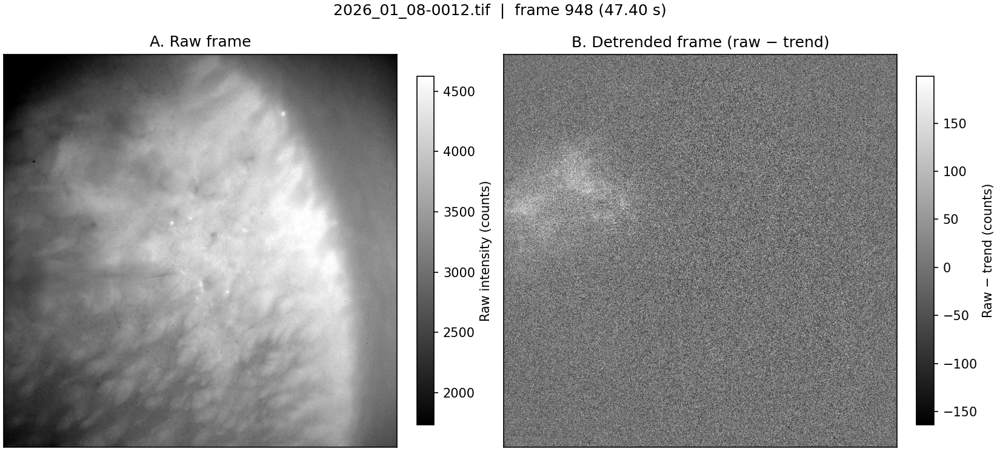
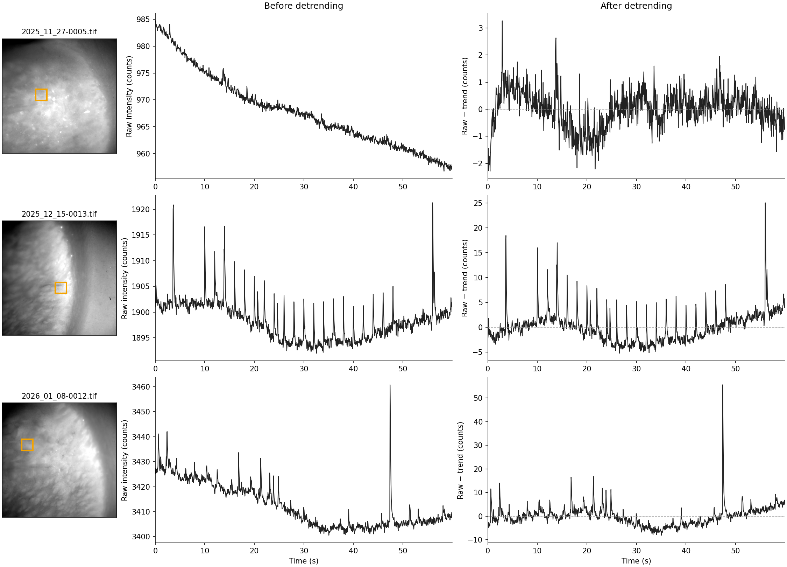
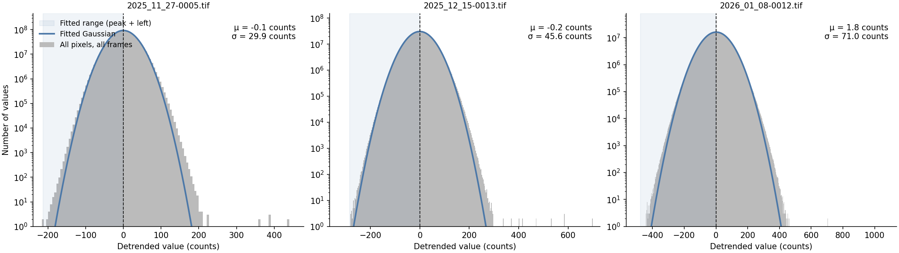
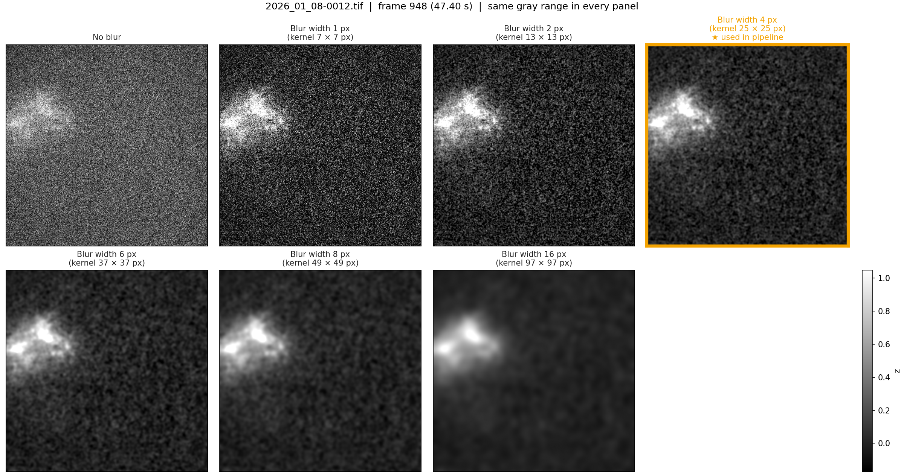
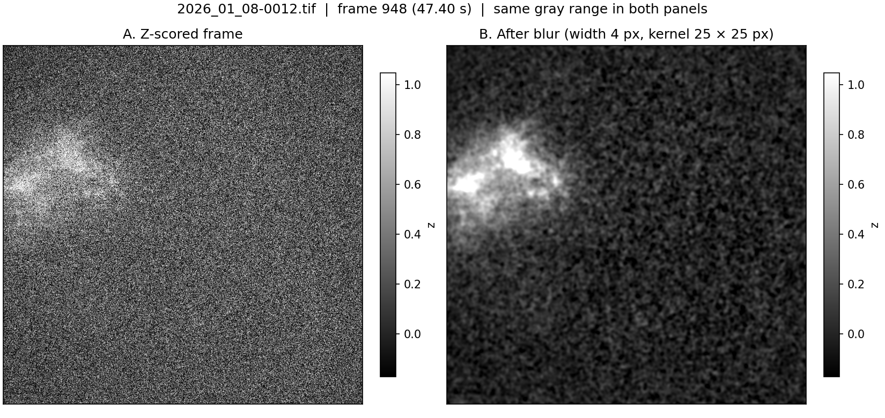
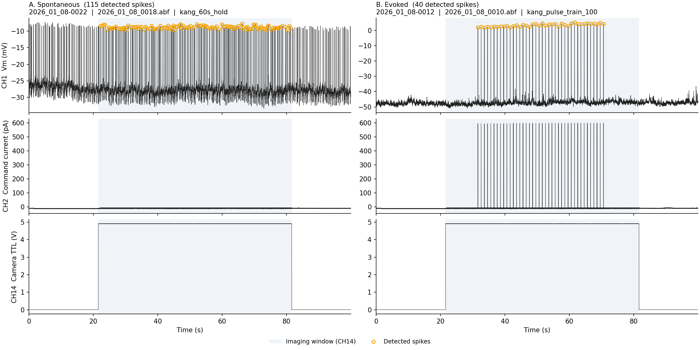
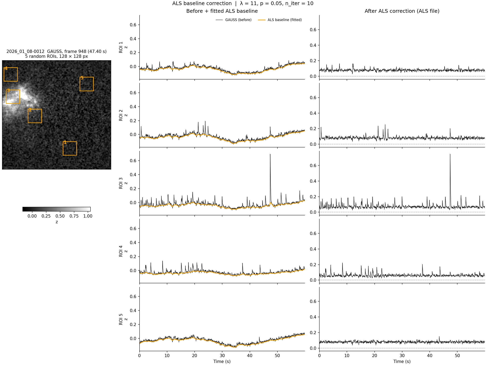

# Plain story: from raw data to ACh release

A plain-language walk-through of what we want to observe and how the data are processed.
Written for Kang and the boss, so it uses as little jargon as possible.

---

## 1. What we want to observe

**Goal:** find **where** in the striatum ACh is released.

- **Who releases ACh?** In the striatum, ACh comes from **cholinergic interneurons (ChIs)**. They sit inside the striatum itself.
- **Why measure ACh?** The amount (concentration) of ACh is the actual agent through which ChIs influence their neighbours. So seeing where and when ACh rises shows where ChIs act.
- **How do we see it?** With a genetically encoded, intensity-based ACh sensor (mainly **GACh3.0**). When the sensor binds ACh, it becomes brighter.

So every raw TIFF stack is a fluorescence movie. A brighter pixel at a given moment means more ACh at that spot.

---

## 2. Problems in the raw TIFFs

Looking at the raw image stacks directly, there are two problems.

| # | Problem | What it looks like | Why it matters |
|---|---|---|---|
| 1 | **Basal brightness** | The sensor glows even without ACh, so the image shows tissue structure with strong contrast. | Real ACh flashes are visible, but small next to this static background. |
| 2 | **Photobleaching** | The fluorescence slowly fades during the recording, fastest at the start. | A slow downward drift is mixed into every pixel's signal. |

Both problems must be removed before we can look for ACh release. This is the job of **pre-processing**.

---

## 3. Pre-processing (`img_proc.py`)

Three steps per recording: **detrend → z-score → blur**. The result is saved as a GAUSS file (3.4).

### 3.1 Pixel-wise detrend with a bi-exponential model

**Idea:** model the bleaching trend of each pixel, then subtract it. What is left is the change in fluorescence, i.e. the ACh signal.

**The model** (t = frame number):

```
trend(t) = A · exp(−t / τ1) + B · exp(−t / τ2) + C
```

- **τ1** = slow time constant (long, gradual bleaching)
- **τ2** = fast time constant (quick bleaching at the start)
- **A, B** = sizes of the two bleaching parts
- **C** = constant baseline brightness

#### 3.1a Why two exponentials, not one?

- A single-exponential model was tried first.
- It fitted the **fast bleaching at the early stage** poorly.
- Adding a second, faster exponential captures that early drop.

#### 3.1b Shared time constants (τ1, τ2)

- Bleaching is a property of the **sensor**, not of the location in the tissue.
- So τ1 and τ2 should be the same, or very similar, everywhere in the image.
- To save time, we estimate them once per recording:
  1. Randomly pick **500 pixels**.
  2. Fit the full bi-exponential model to each one → 500 pairs of (τ1, τ2).
  3. Take the **median τ1** and **median τ2** as the shared constants.

#### 3.1c Fit every pixel (now a linear problem)

- With τ1 and τ2 fixed, the two exponential curves are known shapes.
- Only A, B and C are left to find, and they enter the model linearly.
- So each pixel's trend is a simple linear least-squares fit. This is fast enough to do for every pixel.
- **Output:** raw signal − fitted trend, for every pixel.

#### Figures

**Fig. 1 — Detrending removes the basal intensity.** One frame (`2026_01_08-0012`, frame 948). A: raw frame, tissue brightness dominates. B: the same frame after detrending.



**Fig. 2 — ROI trace before and after detrending.** Mean of a 100 × 100 px ROI on tissue (orange box), in 3 recordings.



---

### 3.2 Normalize to a z-score

**Goal:** put the detrended signal of every recording on the same scale.

#### 3.2a First try: ΔF/F0

- F0 = the fitted trend of each pixel; ΔF/F0 = (raw − trend) / trend.
- **Problem:** the basal intensity is strong and differs from recording to recording. Dividing by it dilutes the signal by a different amount in each recording.
- Example: the same 10-count flash on a basal of ~980 counts (`2025_11_27-0005`) gives ΔF/F0 ≈ 1.0 %. On ~3420 counts (`2026_01_08-0012`) it gives only ≈ 0.3 %.

#### 3.2b Chosen: z-score from the global histogram

1. Pool the detrended values of **all pixels in all frames** into one histogram.
2. Flashes are strong but cover few pixels, so most values are **background fluctuation**. The histogram peak is the background.
3. The flashes add a tail on the right, so the histogram is slightly skewed.
4. Fit a Gaussian to the **peak and its left side only** → background mean μ and spread σ, not pulled by the flashes.
5. z = (value − μ) / σ.

#### 3.2c Why this works

- **Better contrast:** σ comes from the background only, so flashes stand out by many σ.
- **Comparable recordings:** the offset is removed and the unit is σ, the same for every recording.

#### Figure

**Fig. 3 — Global histogram and left-side Gaussian fit.** All pixels in all frames of the detrended stack, 3 recordings (log y-axis). Shaded = fitted range (peak + left side).



---

### 3.3 Spatial Gaussian blur

**Problem:** the detrended frame is noisy pixel by pixel (Fig. 1B). Normalization only rescales the values; it doesn't reduce the noise.

**Why Gaussian, not mean or median?**
- A mean or median filter treats every pixel in a square box the same.
- A Gaussian blur weights the neighbours by distance: close pixels count more, far pixels less.

**Choosing the blur width:**
- Compared blur widths of 1, 2, 4, 6, 8 and 16 px.
- **4–6 px** reduces the noise well without spreading the bright areas too much.
- The pipeline uses **4 px** (kernel 25 × 25 px).

#### Figures

**Fig. 4 — Blur width comparison.** The z-scored frame 948 of `2026_01_08-0012`, unblurred and blurred with widths 1–16 px (kernel size in brackets). Same gray range in every panel. Orange = used in the pipeline.



**Fig. 5 — Flash before and after blur.** The same frame: A, z-scored; B, after the pipeline blur (width 4 px, kernel 25 × 25 px). Same gray range in both panels.



---

### 3.4 Output: the first type of pre-processed files

Steps 3.1–3.3 (detrend → z-score → blur) give the first type of pre-processed files, named with the **`_GAUSS`** suffix.

📂 Stored in `/bucket/WickensU/Kang/Cluster/proc_tiffs`.

---

## 4. Flashes in the GAUSS files

### 4.1 Observation

Opening the `*_GAUSS.tif` files in ImageJ:

- **Multiple flashes** appear at **different locations**.
- They appear in **many frames** (at different times) of a recording.

### 4.2 Question and first guess

**❓ What are they?**

- They are recorded by the ACh sensor (GACh3.0).
- They also appear in recordings **without any stimulation** → they are **spontaneous ACh signals**.
- Each one usually lasts only **a few frames** (50 ms/frame) → they are probably **release events**.

#### Figure

**Fig. 6 — ABF channels of a spontaneous and an evoked recording.** Raw traces of CH1 (Vm), CH2 (command current) and CH14 (camera TTL), cell 2R on 2026_01_08. Shaded = imaging window. A: spontaneous, no current injected. B: evoked, 40 pulses of 600 pA (same recording as Figs. 1–5). Same CH2 range in both columns.



To know them better, we do some simple statistics. Before that, we need to know **which recordings are used and why**, and the basic properties of this dataset.

---

### 4.3 The dataset

#### 4.3a First pick: `proc_/ana_20260618_000.txt` (214 recordings)

This was the first formal dataset sent to the cluster. A recording was picked if its paired ABF file passed four rules:

1. **The ABF has three channels:**
   - **CH1** = membrane potential (Vm) → spike peaks and frequencies.
   - **CH2** = command current → was a pulse train applied? Yes → **evoked**. Anything else, including a holding current → **spontaneous**.
   - **CH14** = digital out 14, the TTL trigger to the camera → actual frame numbers, used to align spikes with frames.
2. **At least one spike** in CH1.
3. **Continuous CH14 triggering.** Some protocols are episodic or split the scan into separate 400-frame blocks; those are excluded.
4. **Paired TIFF:** the matching TIFF is picked, whatever the objective (OBJ).

#### 4.3b Current dataset: `proc_/ana_20260922_000.txt` (201 recordings)

After the first analysis, 13 recordings were removed by hand:

- **2025_01_01** (all 11 recordings): their results had **strong artifacts** (horizontal stripe interference in the raw TIFFs).
- **2025_11_08-0032 and -0033** (2 recordings): tdTomato recordings, not the ACh sensor.

**This is the dataset used for everything in this document.**

#### 4.3c ⚠️ One dataset for both spontaneous and evoked

The same dataset is used for `spontaneous_analysis.py` and the following `ach_domain_analysis.py`.

**Why:** at the moment of picking, the plan was to compare **evoked** ACh release events with **spontaneous** ones, so both kinds were picked together.

#### 4.3d Basic properties

| Item | Count |
|---|---|
| Recording days (1 animal per day) | 17 |
| Animals | 17 (15 neoChAT-Hom, 2 WT; 12 M, 5 F; 9–28 weeks old) |
| Slices | 32 |
| Patched cells | 40 |
| Recordings | 201 |

| Sensor | Animals | Recordings |
|---|---|---|
| GACh3.0 | 13 | 176 |
| iAChSnFR | 2 | 13 |
| rACh1h | 2 | 12 |

| Objective | Recordings |
|---|---|
| 10X | 105 |
| 40X | 14 |
| 60X | 82 |

**Per recording day:**

| Date of recording | Animal | Sensor | Slices | Cells | Recordings | OBJ (recordings) |
|---|---|---|---|---|---|---|
| 2024_10_11 | KC-nChAT-Hom-6 | iAChSnFR | 2 | 2 | 7 | 10X (2), 60X (5) |
| 2024_12_19 | neoChAT-555 | iAChSnFR | 2 | 2 | 6 | 60X (6) |
| 2025_02_05 | neoChAT-549 | GACh3.0 | 3 | 4 | 15 | 60X (15) |
| 2025_02_27 | neoChAT-550 | GACh3.0 | 1 | 1 | 1 | 60X (1) |
| 2025_04_03 | neoChAT-584 | GACh3.0 | 2 | 3 | 15 | 60X (15) |
| 2025_06_11 | neoChAT-587 | GACh3.0 | 1 | 1 | 13 | 10X (10), 60X (3) |
| 2025_07_17 | 202503-022-12 (WT) | rACh1h | 1 | 1 | 3 | 60X (3) |
| 2025_07_19 | 202503-022-11 (WT) | rACh1h | 2 | 2 | 9 | 60X (9) |
| 2025_09_26 | neoChAT-640 | GACh3.0 | 1 | 1 | 4 | 60X (4) |
| 2025_10_13 | neoChAT-632 | GACh3.0 | 2 | 3 | 14 | 60X (14) |
| 2025_11_08 | neoChAT-663 | GACh3.0 | 2 | 2 | 9 | 10X (4), 60X (5) |
| 2025_11_13 | neoChAT-664 | GACh3.0 | 2 | 3 | 19 | 10X (5), 40X (14) |
| 2025_11_27 | neoChAT-660 | GACh3.0 | 3 | 4 | 14 | 10X (14) |
| 2025_12_14 | neoChAT-661 | GACh3.0 | 2 | 3 | 18 | 10X (16), 60X (2) |
| 2025_12_15 | neoChAT-676 | GACh3.0 | 2 | 3 | 22 | 10X (22) |
| 2025_12_18 | neoChAT-662 | GACh3.0 | 2 | 2 | 10 | 10X (10) |
| 2026_01_08 | neoChAT-677 | GACh3.0 | 2 | 3 | 22 | 10X (22) |

---

### 4.4 Recognizing the events

A recording usually contains **many flashes** (ACh release events). Some recordings failed, because of the sensor type (iAChSnFR, rACh1h) or a 0.1X dilution.

**First things to know:** the **number**, **area size** and **location** of the events. So they have to be recognized in the GAUSS files first.

**Plan:** reuse the histogram trick from 3.2.

1. Find the basal (background) z-scored intensity of the pixels.
2. Threshold = basal + **N × σ** (now N = 2).
3. Mask out every pixel below the threshold. What is left are the events.

**Problem:** detrending (3.1) removes only the exponential bleaching trend, **not the slow fluctuations** (Fig. 2). These slow changes make the basal intensity vary a lot over time, so one fixed threshold doesn't fit the whole recording.

---

### 4.5 Baseline correction with ALS (`als_correct.py`)

**Method:** asymmetric least-squares (ALS) smoothing. For each pixel, it fits a smooth baseline that follows the **lower edge** of the trace. Short flashes rise above it and are mostly ignored. The baseline is then subtracted.

**Parameters** (like the detrend, tuned on **5 random ROIs** of 128 × 128 px):

| Parameter | Value | Meaning |
|---|---|---|
| λ (lambda) | 11 | smoothness: larger → smoother baseline |
| p | 0.05 | asymmetry: smaller → baseline hugs the lower edge more |
| n_iter | 10 | number of fitting iterations |

#### Figure

**Fig. 7 — ALS baseline correction.** 5 random 128 × 128 px ROIs of `2026_01_08-0012`, shown on GAUSS frame 948 (left, numbered boxes). Middle: ROI mean of the GAUSS file (black) and the fitted ALS baseline (orange). Right: ROI mean of the ALS file, after correction. Same y range down each column.



---

### 4.6 Output: the second type of pre-processed files

Step 4.5 (ALS correction) gives the second type of pre-processed files, named with the **`_ALS`** suffix.

📂 Stored in `/bucket/WickensU/Kang/Cluster/proc_tiffs`.

**The ALS files are the main pre-processed files** used by the following `spontaneous_analysis.py` and `ach_domain_analysis.py`.

---

*(To be continued.)*
