# Plain story 2: ACh flashes, how large they are and where they recur

## Observation 1

Opening the `*_ALS.tif` files in ImageJ:

- **Multiple flashes** appear in **multiple frames**.
- At **60X**, a flash often covers **most of the field of view** (1024 × 1024 px).

> Note: flashes are recognized frame by frame with a threshold of background peak + 2σ (global histogram of the ALS file). The mask is then cleaned (3 × 3 opening and closing, holes filled) and blobs smaller than **5,000 px** are removed. The limit is in pixels, so in µm² it depends on the objective: 60X 247 µm², 40X 556 µm², 10X 8,889 µm².

**Fig. 1 — Area of 60X flashes.** GACh3.0, 5,773 flashes from 55 recordings (13 slices). Blue = inside the frame (3,091, 54 %), orange = touching the frame edge (2,682, 46 %). Dashed line = frame size (51,782 µm²). The large flashes all touch the frame edge.

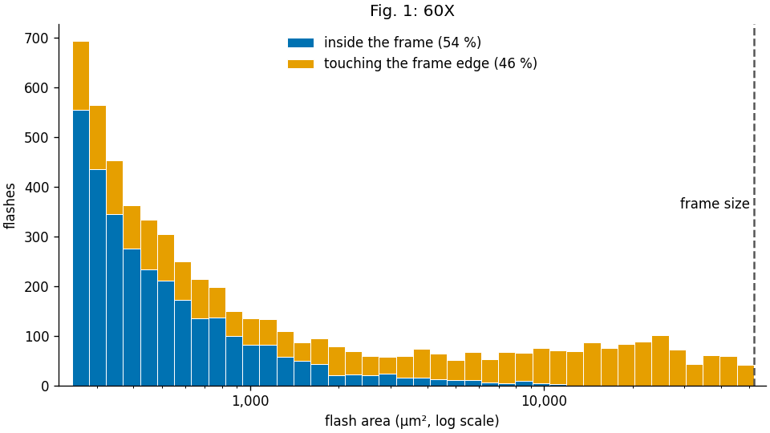

The 40X recordings can be checked the same way.

**Fig. 2 — Area of 40X flashes.** Same as Fig. 1. GACh3.0, 2,308 flashes from 14 recordings (2 slices). Inside the frame 1,103 (48 %), touching the frame edge 1,205 (52 %). Dashed line = frame size (116,508 µm²).

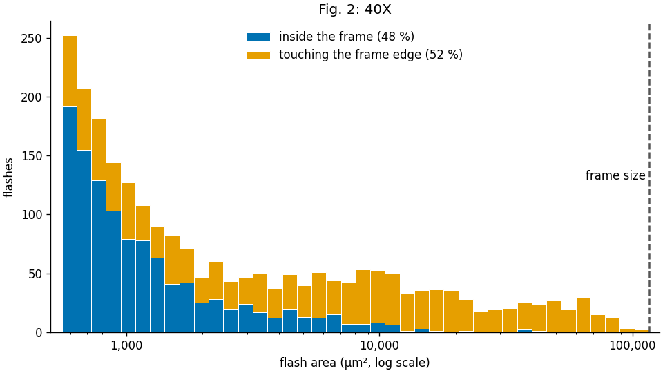

Recordings, slices and animals of Figs. 1–2: `plain_02/tables/flash_area_recordings.xlsx` (sheets `summary`, `60X`, `40X`).

---

## Summary 1

- At 40X and 60X, many flashes are cut by the edge of the field, so their full size can't be measured.
- **→ 10X is the right objective** to see the whole area of a flash.

---

## Question 1

**❓ What is the overall area of the flashes, and how does it compare with the axon arbor of one cholinergic interneuron (ChI)?**

- Yardstick: the area covered by one ChI's axon arbor, measured on the reconstructed rat ChI of Aosaki & Kawaguchi 1996, Fig. 1Ab (slice, biocytin): extent 395 × 263 µm.

**Fig. 3 — Area of 10X flashes vs one ChI's axon arbor.** A: the reconstructed axon (Aosaki & Kawaguchi 1996, Fig. 1Ab) with its convex hull (orange, 78 × 10³ µm²) and bounding box (gray dashed, 104 × 10³ µm²). B: area of every flash, GACh3.0, 10X: 17,567 flashes in 74 recordings (of 103; 29 had none), median 31 × 10³ µm². Below the hull: 80.0 % (reaching: 20.0 %, 3,511 flashes); below the box: 87.2 % (reaching: 12.8 %, 2,246). Flashes = the per-frame flashes of `results/spontaneous/mask/` with blobs < 5,000 px removed (pipeline step 2a: close blobs merged, > 80 % of the frame dropped).

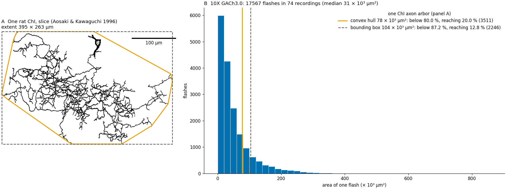

**12.8–20.0 % of flashes can potentially cover the whole field of an axon arborization.**

From this, the flashes **may be produced by single ChIs**.

**Fig. 4 — Flashes touching the frame edge, by objective.** Share of all flashes that touch the frame edge, GACh3.0: 60X 46.5 % (5,773 flashes), 40X 52.2 % (2,308), 10X 39.2 % (19,587). Same flash definition for all three objectives: one connected blob in one frame (the 10X blobs are not merged, so their count differs from Fig. 3).

> Note: the sample sizes are very different: 60X comes from 13 slices, 40X from only 2. The 40X recordings were a quick test to see whether the whole field of a flash could be captured, but the field of view was still too small.

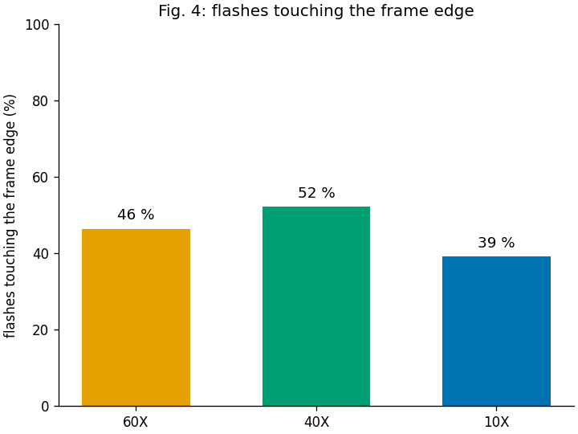

At 10X, 7.3–13.0 percentage points fewer flashes touch the frame edge than at 60X / 40X.

---

## Observation 2

- Flashes seem to **recur at some areas** of the striatum.
- Some flashes appear in **consecutive frames** at the same place.

---

## Question 2

**❓ Can the flashes be grouped by their spatial and temporal relations?**

- If a flash is produced by a certain ChI, the flashes of that ChI should form a group.
- If such groups really exist, it **strengthens the idea** that the flashes are produced by single ChIs, i.e. that they are ACh release events.

---

## Idea for Question 2: grouping

### A trace tells where an ROI is

1. An ROI gives a **temporal trace** (mean intensity inside the ROI, in every frame).
2. Two ROIs at the **same location** give identical traces → Pearson's correlation at 0 lag (r) = **1**.
3. So flashes at **close** locations should have r close to 1.

**Fig. 5 — Correlation between flash traces.** `2026_01_08-0012`. Each flash's footprint is used as an ROI; trace = mean ALS value inside it, every frame. A (frame 17) and B (frame 283, another event) are in recur_zone 2; B is the flash of zone 2 whose trace matches A best. C (frame 1083) is the largest flash of recur_zone 13, which shares no pixel with zone 2. r with A: A = 1, **B = 0.992**, **C = 0.139**. Left: footprints on the max projection. Right: the three traces; dotted line = the flash's own frame.

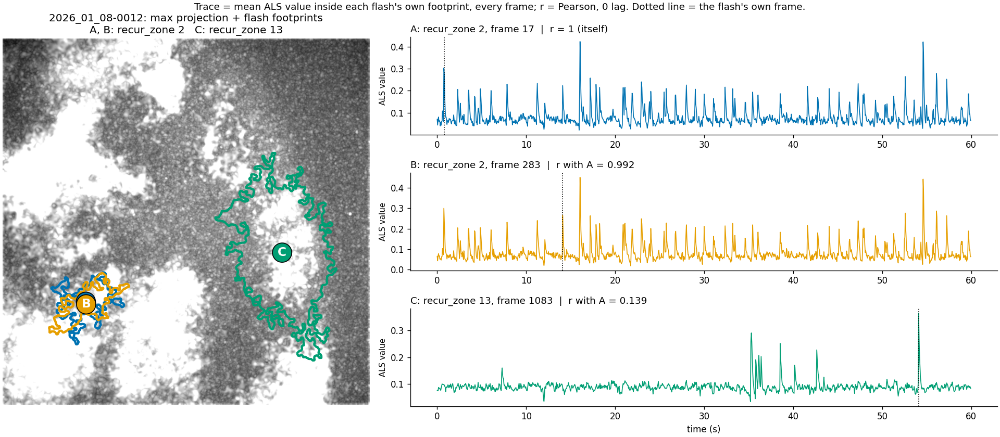

### Grouping steps (`spontaneous_analysis.py`, `classes/sp_zone_analyzer.py`)

1. **Detect flashes.** Threshold = background peak + 2σ of the ALS histogram. Mask cleanup drops blobs smaller than 5,000 px (4,000 px in the current `results/`). Blobs larger than 80 % of the frame are dropped (over-exposed first frames).
2. **Consecutive frames → units.** A flash in frame n+1 joins a flash in frame n if its centroid lies inside n's circle (centroid → farthest pixel). A unit is one flash, or a chain of flashes over consecutive frames.
3. **Traces.** Every flash's footprint is used as an ROI → one trace per flash.
4. **Trace correlation → groups.** r between two units = the **best r** among all pairs of their flashes' traces. A group = units in which **every two** have r ≥ 0.95.
5. **First recur_zones.** Each group is a recur_zone. Its flashes recur at the same place and share the same time course.
6. **Merge.** Some recur_zones are very close but stay separate, because their r is a little lower (e.g. 0.94 or 0.91). A recur_zone ≥ 95 % inside another is merged into it.
7. **Fit leftovers.** A unit that joined no group (a leftover) joins its best recur_zone if its best flash lies ≥ 90 % inside it.
8. **NR zones.** Leftovers that still overlap each other form **NR zones** (non-recurring zones). Single leftovers are dropped.
9. **Only steps 4–7 make recur_zones.** NR zones are shown on the maps for reference, but left out of every statistic.
10. **Events and rate.** An event = a run of consecutive active frames of a recur_zone. Event rate per recur_zone = 1 ÷ mean interval between event starts.

**Fig. 6 — All recur_zones of one recording.** `2025_06_11-0003` (11 recur_zones + 2 NR zones). Left: zone map page 1, max projection with every recur_zone filled. Right: all outlines on white (Jeff's suggestion, planned as page 2 of `{stem}_ZONE_MAPS.tif`). NR zones gray dashed; dashed = striatum boundary.

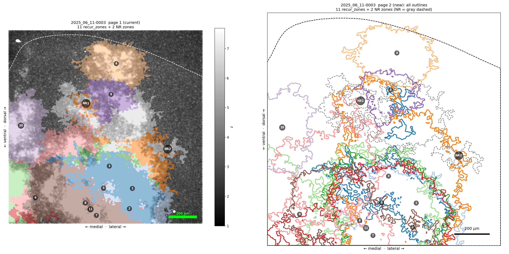

**Fig. 7 — Each recur_zone and the zones it overlaps.** `2025_06_11-0003` (11 recur_zones + 2 NR zones). One panel per recur_zone: its outline plus every zone sharing ≥ 1 px with it; identical sets shown once. Colors as on the zone map; NR zones gray dashed; black dashed = striatum boundary.

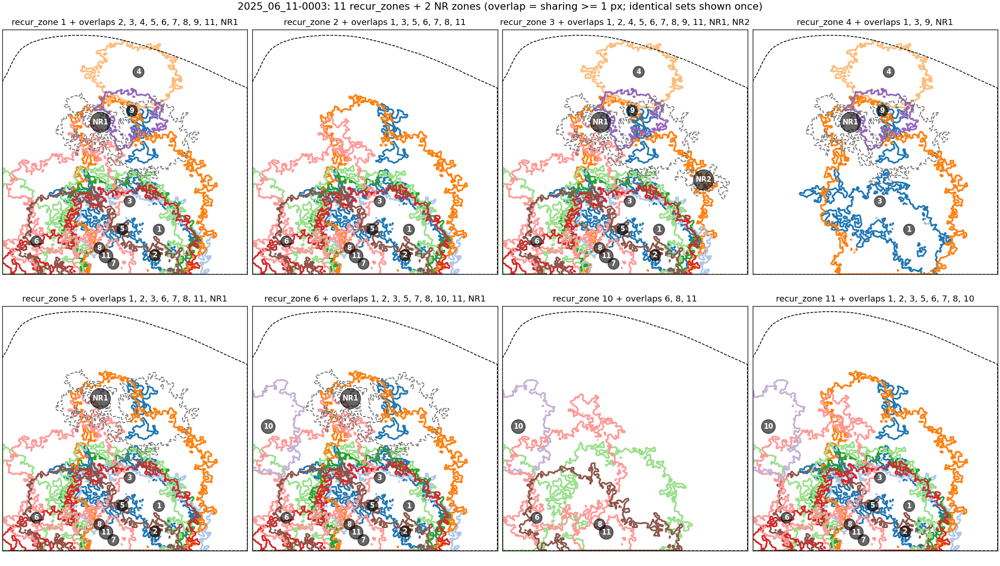

Some recur_zone contours are still close to each other and highly overlapped.

### Montage of grouped zones

To make the maps readable, zones that share a centre are shown together, one panel per group (`plain_02/zone_map_ideas/zone_groups.py`). NR zones are ignored for the grouping.

1. **Centroid** of every recur_zone = centre of mass of its mask.
2. **Circle** of every recur_zone, centred on its centroid. Two versions:
   - **inner circle:** radius = distance to the zone's nearest edge (largest circle at the centroid inside the zone);
   - **furthest circle:** radius = distance to the zone's farthest pixel (circle enclosing the whole zone).
3. **Sort** the zones by area.
4. **Group:** take the smallest remaining zone; every remaining zone whose centroid lies inside its circle joins its group. Draw the group's outlines with the largest at the bottom. Remove the group and repeat until all zones are used.
5. **Last two panels:** the largest zone of every group together, without and with NR zones.

**Fig. 8 — Grouped zones, inner circle.** `2025_06_11-0003`: 8 recur_zones → 5 groups; zones 1, 5, 4 and 3 share a centre. Dotted circle = the smallest zone's circle.

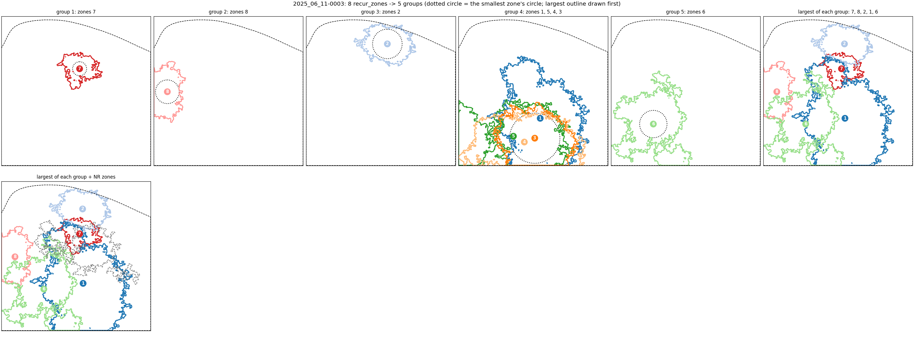

**Fig. 9 — Grouped zones, furthest circle.** Same recording: 8 recur_zones → 4 groups; zones 1, 5, 4, 6 and 3 in one group.

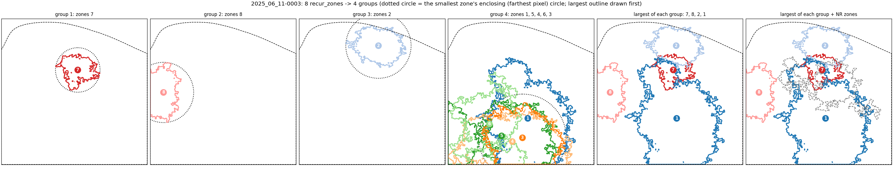

Other examples: `2025_06_11-0008` (8 zones → 7 groups inner / 6 furthest), `2026_01_08-0012` (14 → 12 / 9), same folder.

> Note: Figs. 8–9 already use the new mask cleanup (blobs < 5,000 px removed), so `2025_06_11-0003` has 8 recur_zones here instead of 11 (Figs. 6–7, current `results/`).

---

## Discussion

1. All the contours / outlines together look messy because some zones are still very close and of similar area. One way is to regroup them and show the groups in montages (Figs. 8–9). → Ask Jeff what he thinks.
2. (To be added)

> Note: status of the open items
> 1. ~~The overlap areas between all contours (the new sorted / grouped zones) have not been dealt with.~~ Done (measured only): in the pipeline, the overlap of every pair of group-largest zones (NR excluded) is saved as sheets `overlap_tight` / `overlap_loose` of `{stem}_ZONES.xlsx` (shared area, % of each zone). The contour montages (`zone_contours/{stem}_ZONE_CONTOURS_TIGHT/LOOSE.png`) now start with an "all zones" panel.
> 2. Spontaneous flashes on concatenated recordings of the same slice: tested on 3 slices (below), not in the pipeline yet.
> 3. To do: make the joined analysis an independent pipeline: script at the repo root, SLURM job on Saion, export to `results/contours/` with subfolders (e.g. `joined/`, `comparison/`).

### Test: separated vs joined recordings of one slice

Idea test only, not in the pipeline (`plain_02/slice_concat/slice_concat.py`).

1. Recordings with the same date + SLICE + site (AT) are used together.
2. **Separated:** every recording is analyzed on its own, as in the pipeline.
3. **Joined:** masks, flashes and units stay per recording; from the trace correlation on, the flashes of all recordings are pooled. Each flash's trace runs over all recordings back to back (z-scored per recording), then grouping, merge, fit and NR zones run once.
4. Figures: largest zone of each group (LOOSE = furthest circle), no NR zones. Left = joined, right = separated recordings.

| Slice / site | Recordings | Separated: recur_zones per recording | Joined: recur_zones → largest (LOOSE) |
|---|---|---|---|
| 2025_06_11 4R / CELL_1 | 10 | 6–15 | 23 → 6 |
| 2025_12_15 4R / CELL_2 | 8 | 5–13 | 20 → 5 |
| 2026_01_08 2R / CELL_1 | 10 | 8–16 | 35 → 11 |

**Fig. 10 — Separated vs joined, 2025_06_11 4R / CELL_1 (LOOSE).**

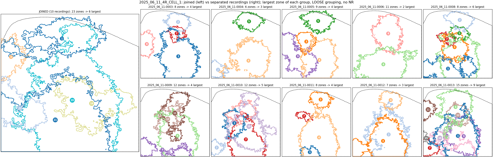

**Fig. 11 — Separated vs joined, 2025_12_15 4R / CELL_2 (LOOSE).**

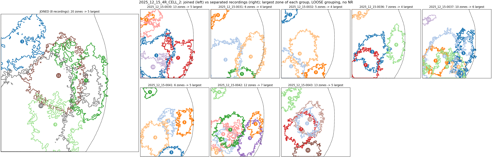

**Fig. 12 — Separated vs joined, 2026_01_08 2R / CELL_1 (LOOSE).**

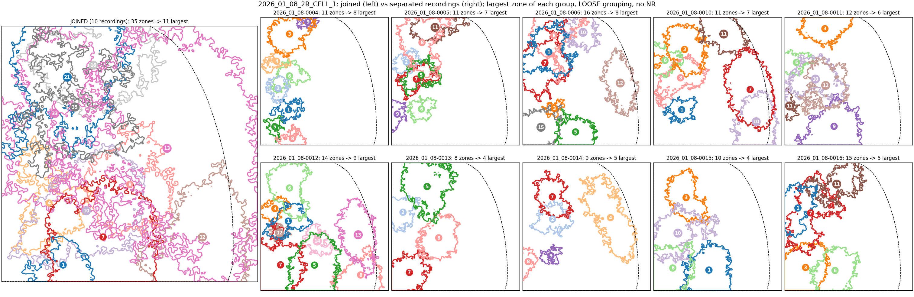

TIGHT versions (inner circle): same folder, `*_SEPARATED_VS_JOINED_TIGHT.png`.

---

*(To be continued.)*
