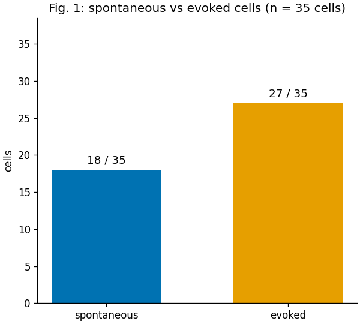
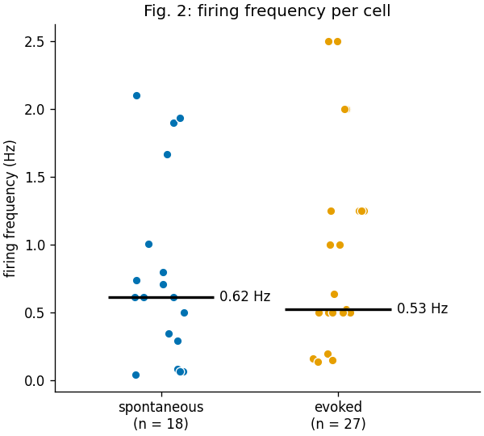

# Plain story 3: Can one ChI supply a compartment?

## Observation 1

- We have several ABFs with recorded spikes of the patched ChIs.
- Some of them have **odd voltage ranges and amplitudes** (patching quality).
- For this part, any recording whose spikes are found by the current `findpeaks` settings is used for the imaging analysis.

---

## Question 1

**❓ Among these recordings, what share is spontaneous and what share is evoked? How fast do the cells fire in each group?**

- The firing frequencies of the two groups are a reference for interpreting the reliability results later.
- Unit = **one independent cell** (animal + slice + cell). A cell with both kinds of recordings is counted in **both** groups.
- One frequency value per cell and recording type.
- All objectives are included (the objective does not change the electrophysiology).

> Note: the group is read from the stimulus waveform stored in each ABF, not from the protocol name (the waveform was sometimes edited without switching protocols).
> - **Evoked** = pulse train (≥ 2 pulses). Frequency = spikes inside the train ÷ train duration.
> - **Spontaneous** = no stimulus, or a long DC step (e.g. +300 pA for 60 s). Frequency = spikes ÷ imaging (TTL) window.
> - **Single-pulse** recordings are left out.
> - Recordings with **< 2 spikes** are left out (1 spike ÷ 60 s only reflects the recording length).

**Fig. 1 — Spontaneous vs evoked cells.** 201 recordings of the paper list (`ana_20260922_000_deigo.txt`); 38 single-pulse and 27 with < 2 spikes left out → 136 recordings (44 spontaneous, 92 evoked) of 35 cells from 14 animals. Spontaneous: 18 / 35 cells; evoked: 27 / 35 cells (10 cells have both and are counted in both groups).

**Fig. 2 — Firing frequency per cell.** One dot = one cell (median of its recordings of that group); black line = group median. Spontaneous: 18 cells, 0.62 [0.29–1.01] Hz (median [IQR]). Evoked: 27 cells, 0.53 [0.50–1.25] Hz. Evoked cells sit at the stimulus rates of the trains (0.5, 1.0, 1.25, 2.0, 2.5 Hz).

Recordings and cells of Figs. 1–2: `plain_03/tables/firing.xlsx` (sheets `recordings`, `cells`); script `plain_03/scripts/fig1_2_firing.py`.

---
